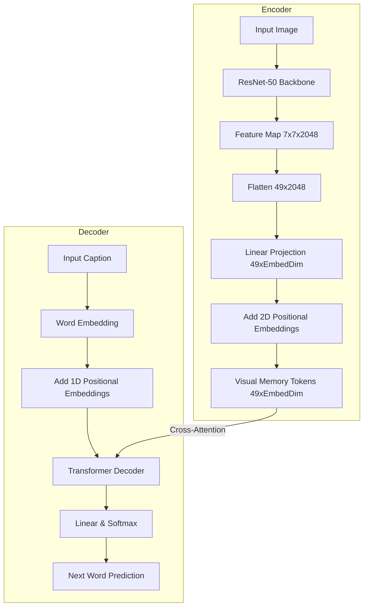

# Image Captioning

A robust Image Captioning project leveraging a **ResNet-50** image encoder and a **Transformer** decoder. This model learns to map an input image to a descriptive natural language caption using spatial visual features and attention mechanisms.

---

## 🏗️ Architecture & Changes

The architecture consists of an Encoder-Decoder structure:

1. **Image Encoder (ResNet-50)**
   - The final adaptive pooling layer and fully connected layers are removed, retaining the full `7×7×2048` feature map.
   - These 49 spatial visual tokens are projected from 2048 dimensions to the model's `embed_dim` (e.g., 256).
   - A custom 2D visual positional embedding is added to provide spatial context to the transformer.
   - The ResNet layer-4 block is unfrozen later in training (e.g., epoch 12) for fine-tuning.

2. **Caption Decoder (Transformer)**
   - A multi-layer `TransformerDecoder` takes the shifted target captions (for teacher forcing) and the visual tokens as memory.
   - The model learns to cross-attend to specific spatial regions of the image when predicting the next word.

### Architecture Diagram



---

## 🚀 Steps to Run

### 1. Prerequisites & Environment

Make sure you have Python 3.10+ installed. Install the required dependencies:

```bash
pip install torch torchvision
pip install streamlit pillow nltk rouge_score tqdm
```

### 2. Dataset Preparation

Place your dataset in the `data/` folder. The default expected structure is:
- Images: `data/raw/images/`
- Annotations: `data/raw/tiny-trcap-en.json` (COCO format)

### 3. Build Vocabulary

Generate the vocabulary from your training annotations. This creates a `vocab.json` file.

```bash
cd model_training
python build_vocab.py
```

### 4. Training

Start the training script. This will prepare the DataLoaders (with augmentations), train the model, evaluate on the validation set, and save checkpoints to `checkpoints/`.

```bash
python train.py
```
*Note: Layer 4 of the ResNet backbone is frozen initially and will automatically unfreeze at epoch 12 for fine-tuning.*

### 5. Evaluation

Evaluate the best model on the test split using BLEU and ROUGE-L metrics.

```bash
python evaluate.py
```
This generates an `eval_results.json` file with your final scores.

### 6. Interactive UI

To test the model interactively, run the Streamlit application. You can upload images or pick samples and generate captions using Beam Search.

```bash
cd ..
streamlit run src/app.py
```

---

## 📊 Results

We have trained and evaluated two versions of the model:
1. **Model v1 (`modelv1.py`)**: The initial baseline model using a global average pooled vector from ResNet.
2. **Model v2 (`model.py`)**: An improved architecture utilizing all 49 spatial visual tokens as memory for the Transformer decoder, and fine-tuning the ResNet layer 4.

The models were evaluated on the test split (215 samples) using Beam Search.

| Metric        | Model v1 (`modelv1.py`) | Model v2 (`model.py`) |
| ------------- | :---------------------: | :-------------------: |
| **BLEU-1**    | 0.2979                  | 0.2952                |
| **BLEU-2**    | 0.1844                  | 0.1857                |
| **BLEU-3**    | 0.1262                  | 0.1287                |
| **BLEU-4**    | 0.0884                  | 0.0891                |
| **ROUGE-L**   | 0.2839                  | 0.2885                |
| **Time (s)**  | 370.6s                  | 337.5s                |

The improved model (v2) shows consistent performance gains across BLEU-2, 3, 4, and ROUGE-L, while also running inference noticeably faster.

Key tracking metrics include:
- **BLEU-1 to BLEU-4**: Measures n-gram overlap between predicted and ground-truth captions.
- **ROUGE-L**: Evaluates the longest common subsequence to measure sentence-level structure.
- **Beam Search Decoding**: The Streamlit interface uses a beam size of 5 (configurable) to improve caption fluency.

---

## 🔮 Future Improvements

1. **Vision Transformers (ViT) / Swin / ConvNeXt**: Replace the ResNet-50 backbone with a modern vision backbone for richer feature extraction.
2. **CIDEr Optimization**: Fine-tune the model using Reinforcement Learning (REINFORCE) directly on the CIDEr metric, which aligns better with human judgment.
3. **Larger Scale Pre-training**: Pre-train the model on a massive dataset like MS-COCO or Conceptual Captions before fine-tuning on the domain-specific dataset.
4. **Attention Visualization**: Add a feature to the UI to visualize the cross-attention weights, showing which part of the image the model looks at when generating each word.
